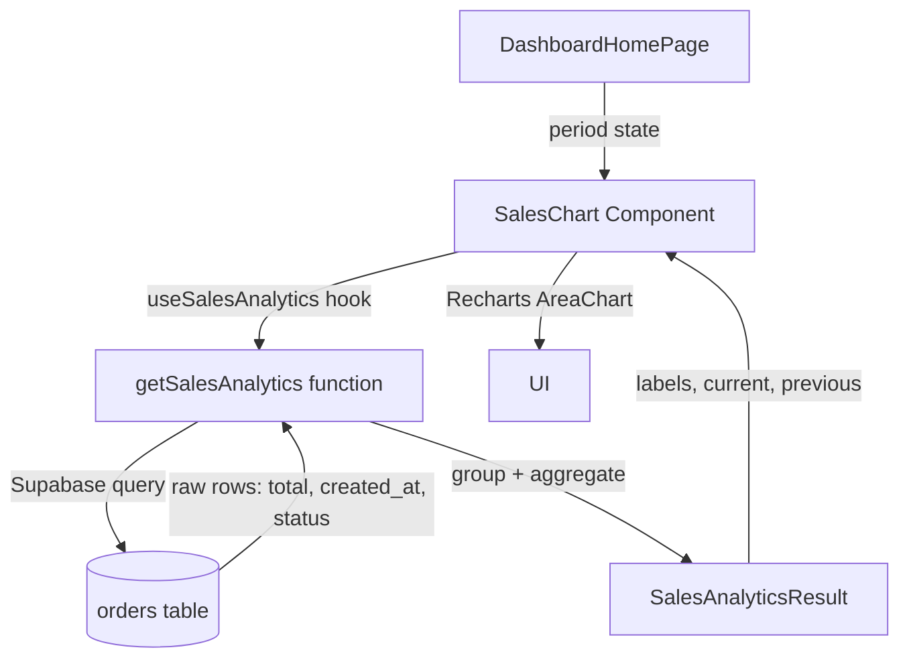
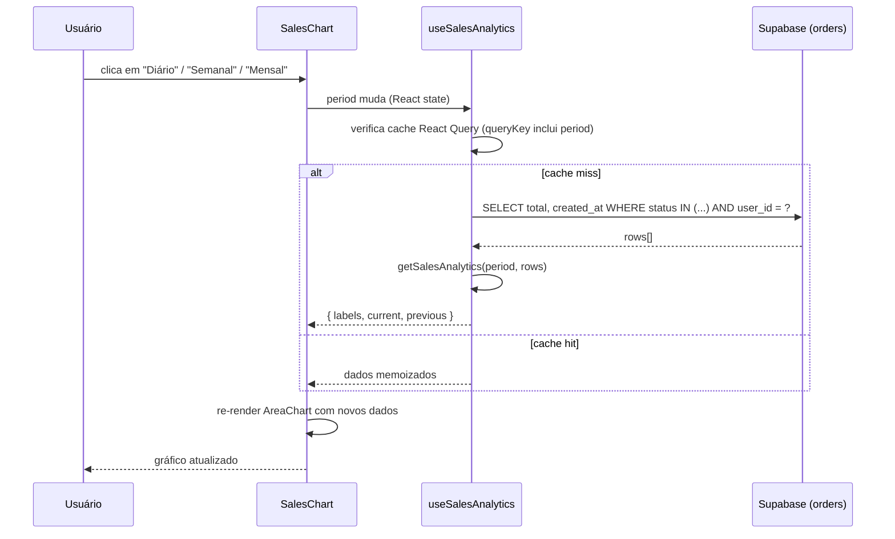

# Design Document: Sales Analytics Chart

## Overview

Transformar o gráfico "Vendas ao longo do tempo" do `DashboardHomePage` de dados mockados para dados reais, consumindo a tabela `orders` do Supabase. O sistema deve suportar agrupamento por período (diário, semanal, mensal), comparar o período atual com o anterior e exibir os valores formatados em BRL.

O projeto usa **TypeScript + React + Supabase + Recharts** e já possui a infraestrutura de autenticação e queries via `@tanstack/react-query`.

---

## Architecture



---

## Sequence Diagrams

### Fluxo principal — troca de período



---

## Components and Interfaces

### 1. `getSalesAnalytics` — função pura de agregação

**Purpose**: Recebe os pedidos brutos e o período, retorna os dados formatados para o gráfico.

**Interface**:
```typescript
type Period = "daily" | "weekly" | "monthly"

interface OrderRow {
  total: number
  created_at: string  // ISO 8601
}

interface SalesAnalyticsResult {
  labels: string[]    // ex: ["Seg", "Ter", ...] | ["S1", "S2", ...] | ["Jan", "Fev", ...]
  current: number[]   // faturamento do período atual por label
  previous: number[]  // faturamento do período anterior por label
}

function getSalesAnalytics(
  period: Period,
  orders: OrderRow[]
): SalesAnalyticsResult
```

**Responsibilities**:
- Definir janelas de tempo (atual e anterior) com base no `period`
- Filtrar pedidos por janela
- Agrupar e somar `total` por bucket (dia/semana/mês)
- Garantir que todos os buckets existam (valor 0 se sem dados)
- Retornar labels e arrays alinhados por índice

---

### 2. `useSalesAnalytics` — hook React Query

**Purpose**: Busca os pedidos do Supabase e aplica `getSalesAnalytics`, com cache por período.

**Interface**:
```typescript
function useSalesAnalytics(period: Period): {
  data: SalesAnalyticsResult | undefined
  isLoading: boolean
  error: Error | null
}
```

**Responsibilities**:
- Query Supabase: `orders` filtrado por `status IN ('paid','approved','completed')` e `user_id`
- Passar rows para `getSalesAnalytics`
- Cache via `queryKey: ["sales-analytics", userId, period]`
- Retornar estado de loading/error para o componente

---

### 3. `SalesChart` — componente React

**Purpose**: Renderiza o gráfico de área com os dados reais, substituindo os dados mockados no `DashboardHomePage`.

**Interface**:
```typescript
interface SalesChartProps {
  period: "Diário" | "Semanal" | "Mensal"
  onPeriodChange: (p: "Diário" | "Semanal" | "Mensal") => void
}
```

**Responsibilities**:
- Mapear `period` PT-BR → `Period` EN para o hook
- Exibir skeleton durante loading
- Renderizar `AreaChart` com dados reais
- Manter visual atual: linha azul (atual) + laranja (anterior)
- Tooltip com `Intl.NumberFormat` BRL

---

## Data Models

### OrderRow (entrada)

```typescript
interface OrderRow {
  total: number       // valor do pedido
  created_at: string  // ISO 8601 timestamp
}
```

**Fonte**: tabela `orders` no Supabase  
**Filtro de status**: `['paid', 'approved', 'completed']`

---

### SalesAnalyticsResult (saída)

```typescript
interface SalesAnalyticsResult {
  labels: string[]   // rótulos do eixo X
  current: number[]  // soma de `total` por bucket — período atual
  previous: number[] // soma de `total` por bucket — período anterior
}
```

**Invariante**: `labels.length === current.length === previous.length`

---

## Algorithmic Pseudocode

### Algoritmo principal: `getSalesAnalytics`

```pascal
ALGORITHM getSalesAnalytics(period, orders)
INPUT:  period ∈ {"daily", "weekly", "monthly"}
        orders: Array<{total: number, created_at: string}>
OUTPUT: result ∈ SalesAnalyticsResult

BEGIN
  now ← currentDate()

  // Definir janelas de tempo
  IF period = "daily" THEN
    currentStart  ← startOfDay(now - 6 days)
    currentEnd    ← endOfDay(now)
    previousStart ← startOfDay(now - 13 days)
    previousEnd   ← endOfDay(now - 7 days)
    buckets       ← ["Seg", "Ter", "Qua", "Qui", "Sex", "Sáb", "Dom"]
    getBucket     ← (date) → dayOfWeekLabel(date)
  ELSE IF period = "weekly" THEN
    currentStart  ← startOfMonth(now)
    currentEnd    ← endOfMonth(now)
    previousStart ← startOfMonth(now - 1 month)
    previousEnd   ← endOfMonth(now - 1 month)
    buckets       ← ["S1", "S2", "S3", "S4"]
    getBucket     ← (date) → weekOfMonthLabel(date)
  ELSE // monthly
    currentStart  ← startOfYear(now)
    currentEnd    ← endOfYear(now)
    previousStart ← startOfYear(now - 1 year)
    previousEnd   ← endOfYear(now - 1 year)
    buckets       ← ["Jan", "Fev", "Mar", "Abr", "Mai", "Jun",
                      "Jul", "Ago", "Set", "Out", "Nov", "Dez"]
    getBucket     ← (date) → monthLabel(date)
  END IF

  // Inicializar acumuladores com 0
  currentMap  ← Map { bucket → 0 | bucket ∈ buckets }
  previousMap ← Map { bucket → 0 | bucket ∈ buckets }

  // Agregar pedidos
  FOR each order IN orders DO
    date ← parseDate(order.created_at)

    IF date ∈ [currentStart, currentEnd] THEN
      bucket ← getBucket(date)
      IF bucket ∈ currentMap THEN
        currentMap[bucket] ← currentMap[bucket] + order.total
      END IF
    ELSE IF date ∈ [previousStart, previousEnd] THEN
      bucket ← getBucket(date)
      IF bucket ∈ previousMap THEN
        previousMap[bucket] ← previousMap[bucket] + order.total
      END IF
    END IF
  END FOR

  // Montar resultado alinhado por índice
  RETURN {
    labels:   buckets,
    current:  buckets.map(b → currentMap[b]),
    previous: buckets.map(b → previousMap[b])
  }
END
```

**Preconditions:**
- `orders` é um array válido (pode ser vazio)
- `order.total` é número ≥ 0
- `order.created_at` é string ISO 8601 válida

**Postconditions:**
- `result.labels.length === result.current.length === result.previous.length`
- Todos os valores em `current` e `previous` são ≥ 0
- Pedidos sem dados resultam em 0 (nunca `undefined` ou `NaN`)

**Loop Invariants:**
- `currentMap` e `previousMap` contêm apenas buckets válidos
- Cada pedido é contabilizado no máximo uma vez (atual OU anterior, nunca ambos)

---

### Algoritmo auxiliar: `weekOfMonthLabel`

```pascal
ALGORITHM weekOfMonthLabel(date)
INPUT:  date: Date
OUTPUT: label ∈ {"S1", "S2", "S3", "S4"}

BEGIN
  day ← dayOfMonth(date)

  IF day ≤ 7  THEN RETURN "S1"
  IF day ≤ 14 THEN RETURN "S2"
  IF day ≤ 21 THEN RETURN "S3"
  ELSE             RETURN "S4"
END
```

---

## Key Functions with Formal Specifications

### `getSalesAnalytics(period, orders)`

**Preconditions:**
- `period ∈ {"daily", "weekly", "monthly"}`
- `orders` é array (pode ser vazio)
- Para todo `o ∈ orders`: `o.total ≥ 0` e `o.created_at` é ISO 8601 válido

**Postconditions:**
- `result.labels.length === result.current.length === result.previous.length`
- `∀ i: result.current[i] ≥ 0 ∧ result.previous[i] ≥ 0`
- Se `orders = []` → `result.current = [0, 0, ...]` e `result.previous = [0, 0, ...]`

---

### `useSalesAnalytics(period)`

**Preconditions:**
- Hook chamado dentro de componente React com `AuthContext` disponível
- `user` autenticado (hook desabilitado se `!user`)

**Postconditions:**
- Enquanto `isLoading = true`: `data = undefined`
- Quando resolvido: `data` satisfaz postconditions de `getSalesAnalytics`
- Cache invalidado quando `period` ou `userId` muda

---

## Example Usage

```typescript
// Hook no componente
const { data, isLoading } = useSalesAnalytics(period)

// Dados para o gráfico (com fallback seguro)
const chartData = data
  ? data.labels.map((label, i) => ({
      d: label,
      v: data.current[i],
      p: data.previous[i],
    }))
  : []

// Tooltip formatado em BRL
const fmt = (v: number) =>
  new Intl.NumberFormat("pt-BR", { style: "currency", currency: "BRL" }).format(v)

// Exemplo de resultado para period="weekly"
// {
//   labels:   ["S1", "S2", "S3", "S4"],
//   current:  [15000, 18000, 17000, 22000],
//   previous: [12000, 15000, 18000, 19000]
// }
```

---

## Correctness Properties

1. **Completude dos buckets**: Para qualquer `period`, o resultado sempre contém todos os buckets esperados, mesmo sem dados.
   - `∀ period: getSalesAnalytics(period, []).labels.length > 0`

2. **Não-negatividade**: Nenhum valor de faturamento é negativo.
   - `∀ i: result.current[i] ≥ 0 ∧ result.previous[i] ≥ 0`

3. **Alinhamento de arrays**: Labels, current e previous têm sempre o mesmo comprimento.
   - `result.labels.length === result.current.length === result.previous.length`

4. **Separação de períodos**: Um pedido nunca é contado em ambos os períodos.
   - Janelas atual e anterior são mutuamente exclusivas

5. **Idempotência do cache**: Chamar `useSalesAnalytics` com o mesmo `period` e `userId` retorna os mesmos dados sem nova query ao Supabase.

6. **Graceful empty state**: Com `orders = []`, o gráfico renderiza com todos os valores zerados, sem erros.

---

## Error Handling

### Erro de rede / Supabase indisponível

**Condition**: Query ao Supabase falha  
**Response**: `isLoading = false`, `error` preenchido, `data = undefined`  
**Recovery**: React Query faz retry automático (3x por padrão); componente exibe skeleton ou estado vazio

### Tabela `orders` sem coluna `total`

**Condition**: Schema diverge do esperado  
**Response**: `order.total` retorna `undefined`; tratado com `?? 0` na agregação  
**Recovery**: Todos os valores ficam 0; gráfico renderiza sem crash

### Usuário sem pedidos

**Condition**: Query retorna array vazio  
**Response**: `getSalesAnalytics` retorna arrays de zeros  
**Recovery**: Gráfico exibe linhas zeradas — comportamento esperado e documentado

### `created_at` inválido

**Condition**: String de data malformada  
**Response**: `parseDate` retorna `Invalid Date`; comparação de intervalo falha silenciosamente  
**Recovery**: Pedido ignorado na agregação (não contabilizado em nenhum bucket)

---

## Testing Strategy

### Unit Testing

- `getSalesAnalytics` com arrays de pedidos variados (vazio, 1 pedido, múltiplos períodos)
- Verificar alinhamento de arrays para cada `period`
- Verificar que pedidos com status inválido não chegam à função (filtro no hook)
- Verificar `weekOfMonthLabel` para dias limítrofes (1, 7, 8, 14, 15, 21, 22, 31)

### Property-Based Testing

**Library**: `fast-check`

- **Propriedade 1**: Para qualquer array de pedidos, `labels.length === current.length === previous.length`
- **Propriedade 2**: Para qualquer array de pedidos com `total ≥ 0`, todos os valores de saída são `≥ 0`
- **Propriedade 3**: Para `orders = []`, todos os valores são `0`
- **Propriedade 4**: Somar todos os valores de `current` nunca excede a soma de `total` dos pedidos do período atual

### Integration Testing

- `useSalesAnalytics` com Supabase mockado retorna estrutura correta
- Troca de período dispara nova query (queryKey diferente)
- Componente `SalesChart` renderiza sem crash com `data = undefined` (loading state)

---

## Performance Considerations

- **Memoização via React Query**: Cache por `["sales-analytics", userId, period]` — sem recálculo desnecessário ao re-render
- **Função pura**: `getSalesAnalytics` é pura e pode ser envolvida em `useMemo` se necessário
- **Query otimizada**: Buscar apenas `total` e `created_at` (sem `SELECT *`) reduz payload
- **Filtro no banco**: Status filter aplicado no Supabase (não no cliente) para reduzir dados transferidos

---

## Security Considerations

- **Row Level Security (RLS)**: A query inclui `user_id = auth.uid()` — garantir que RLS está habilitado na tabela `orders`
- **Sem exposição de dados de outros usuários**: `queryKey` inclui `userId` para evitar cache compartilhado entre usuários
- **Validação de entrada**: `period` é um tipo literal TypeScript — sem risco de injeção

---

## Dependencies

- `@supabase/supabase-js` — já instalado (`src/integrations/supabase/client.ts`)
- `@tanstack/react-query` — já instalado (usado em `useDashboard.ts`)
- `recharts` — já instalado (`DashboardHomePage.tsx`)
- `date-fns` ou manipulação nativa de `Date` — para cálculo de janelas de tempo (verificar se `date-fns` está disponível no projeto)
